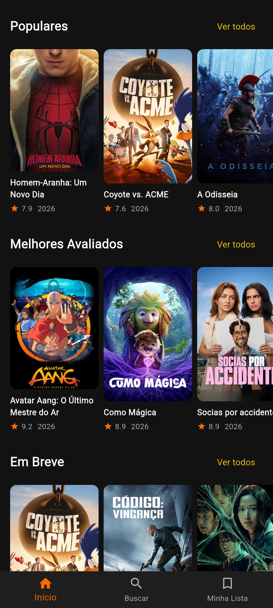

# 🎬 HZ Filmes

<p align="center">
  
</p>

<p align="center">
  <strong>App de catálogo de filmes moderno, rápido e com tema escuro</strong><br/>
  Desenvolvido em Flutter com Clean Architecture, BLoC e Material Design 3
</p>

<p align="center">
  
  
  
  
  
  
</p>

---

## 📱 Screenshots

<p align="center">
  <em>Home, detalhes do filme, busca, favoritos e listas com paginação.</em>
</p>

<p align="center">
  <!-- Substitua pelos seus screenshots em assets/screenshots/ -->
  
  
  
  
  
  
  
  
</p>

---

## ✨ Funcionalidades

* 🏠 **Home com seções dinâmicas**
  * Em Alta (trending)
  * Populares
  * Melhores Avaliados
  * Em Breve
  * Em Cartaz
* 🎠 **Banner em destaque** com carrossel e cache diário
* 🔎 **Busca de filmes** com paginação infinita
* 📄 **Detalhes completos do filme**
  * Poster, backdrop, nota, ano e duração
  * Gêneros e tagline
  * Sinopse
  * Elenco principal
  * Filmes semelhantes
* 📺 **Onde assistir** (Watch Providers — região BR)
  * Streaming, aluguel e compra
  * Mensagem **“Disponível apenas nos cinemas”** quando não há providers
* ▶️ **Trailers** com player do YouTube embutido
* ⭐ **Minha Lista (favoritos)** com persistência local
* 📋 **Ver todos** — listas completas com scroll infinito
* 🔄 **Pull-to-refresh** na home
* 🚀 **Splash screen** com branding
* 🌙 **Tema escuro** com Material Design 3
* 🖼️ **Imagens em cache** com shimmer de loading
* ⚠️ **Estados de UI** (loading, erro e empty states)

---

# 🛠️ Stack & Competências

## 💻 Linguagens e Frameworks

| Tecnologia            | Uso no projeto                               |
| --------------------- | -------------------------------------------- |
| **Dart 3**            | Linguagem principal                          |
| **Flutter**           | Desenvolvimento da interface multiplataforma |
| **Material Design 3** | Design system, temas e componentes           |

---

## 🏗️ Arquitetura

| Competência                        | Aplicação                                                                 |
| ---------------------------------- | ------------------------------------------------------------------------- |
| **Clean Architecture**             | Separação em `core`, `data`, `domain` e `presentation`                    |
| **State Management**               | BLoC (`flutter_bloc`) + Equatable                                         |
| **Repository Pattern**             | Contrato no domain + implementação no data                                |
| **Separação de responsabilidades** | UI desacoplada da lógica de negócio e das APIs                            |

---

## 🌐 Dados e Rede

| Competência                     | Aplicação                                                      |
| ------------------------------- | -------------------------------------------------------------- |
| **API REST**                    | Comunicação HTTP + JSON via Dio                                |
| **TMDB API**                    | Filmes, busca, detalhes, elenco, trailers e watch providers    |
| **Cliente HTTP centralizado**   | `DioClient` com interceptors de log e tratamento de erros      |
| **Paginação**                   | Listas e busca com carregamento sob demanda                    |
| **Tratamento de erros de rede** | Timeout, falhas de API e feedback amigável na UI               |

---

## 📱 Persistência e Mídia

| Competência              | Aplicação                                              |
| ------------------------ | ------------------------------------------------------ |
| **Persistência local**   | SharedPreferences / Hive para favoritos e cache        |
| **Cache de imagens**     | `cached_network_image` + placeholders com shimmer      |
| **Trailers**             | `youtube_player_flutter` para reprodução inline        |
| **Links externos**       | `url_launcher` para abrir páginas de providers         |
| **Datas e formatação**   | `intl` com suporte a `pt_BR`                           |

---

## 🎨 UX / UI

| Competência                 | Aplicação                                           |
| --------------------------- | --------------------------------------------------- |
| **Tema escuro**             | Paleta customizada com laranja de destaque          |
| **Estados de UI**           | Loading, erro, empty e conteúdo                     |
| **Shimmer**                 | Skeleton loading em cards e home                    |
| **Listas horizontais**      | Seções de filmes e elenco                           |
| **Grid com paginação**      | Tela “Ver todos” e resultados de busca              |
| **Navegação por abas**      | Início, Buscar e Minha Lista                        |
| **Splash animada**          | Entrada com branding do app                         |

---

## 🧪 Qualidade e Boas Práticas

| Competência                        | Aplicação                                                          |
| ---------------------------------- | ------------------------------------------------------------------ |
| **Null Safety**                    | Dart null-safe                                                     |
| **Widgets reutilizáveis**          | `MovieCard`, `MovieSection`, `FeaturedBanner`, `TrailerCard`       |
| **BLoCs testáveis**                | Events/States separados + `bloc_test` no projeto                   |
| **Ciclo de vida**                  | `dispose` de controllers e players                                 |
| **Separação de responsabilidades** | Datasources, repositories, blocs e pages independentes             |

---

# 📁 Estrutura do Projeto

```text
lib/
├── main.dart
│
├── core/
│   ├── constants/
│   │   └── api_constants.dart      # Base URL, API key e endpoints TMDB
│   ├── network/
│   │   └── dio_client.dart         # Cliente HTTP + interceptors
│   └── theme/
│       └── app_theme.dart          # Tema escuro e cores
│
├── data/
│   ├── datasources/
│   │   └── remote/
│   │       └── movie_remote_datasource.dart
│   ├── models/
│   │   ├── movie_model.dart
│   │   ├── video_model.dart
│   │   └── watch_provider_model.dart
│   └── repositories/
│       └── movie_repository_impl.dart
│
├── domain/
│   └── repositories/
│       └── movie_repository.dart   # Contrato abstrato
│
└── presentation/
    ├── blocs/
    │   ├── home/
    │   ├── search/
    │   ├── favorites/
    │   ├── movie_detail/
    │   └── movie_list/
    ├── pages/
    │   ├── splash_page.dart
    │   ├── main_page.dart
    │   ├── home_page.dart
    │   ├── search_page.dart
    │   ├── favorites_page.dart
    │   ├── movie_detail_page.dart
    │   └── movie_list_page.dart
    └── widgets/
        ├── movie_card.dart
        ├── movie_section.dart
        ├── featured_banner.dart
        ├── trailer_card.dart
        └── home_loading.dart
```

---

# 🚀 Como Rodar

## 📋 Pré-requisitos

* Flutter SDK **3.13+**
* Dart compatível com a versão instalada do Flutter
* Android Studio e/ou Xcode
* Emulador ou dispositivo físico
* Git
* Conta e API Key no [The Movie Database (TMDB)](https://www.themoviedb.org/settings/api)

---

## 🔑 Configurar a API Key

1. Crie uma conta em [themoviedb.org](https://www.themoviedb.org/)
2. Gere uma API Key em **Settings → API**
3. Substitua a chave em:

```text
lib/core/constants/api_constants.dart
```

```dart
static const String apiKey = 'SUA_API_KEY_AQUI';
```

> **Dica para portfólio:** em produção, prefira passar a key via `--dart-define` em vez de deixar no código-fonte.

---

## 📥 Clonar o projeto

```bash
git clone https://github.com/SEU_USUARIO/hz_filmes.git
cd hz_filmes
flutter pub get
```

---

## ▶️ Executar

```bash
flutter run
```

---

# 📦 Build Release — Android

Para gerar uma versão de produção:

```bash
flutter build apk --release
```

O APK será gerado em:

```text
build/app/outputs/flutter-apk/app-release.apk
```

Também é possível executar diretamente em modo release:

```bash
flutter run --release
```

---

# 🔐 Permissões

## Android

Arquivo:

```text
android/app/src/main/AndroidManifest.xml
```

Permissão utilizada:

```xml
<uses-permission android:name="android.permission.INTERNET"/>
```

### Finalidade

| Permissão  | Finalidade                                      |
| ---------- | ----------------------------------------------- |
| `INTERNET` | Comunicação com a API do TMDB e imagens/trailers |

---

## 🍎 iOS

Arquivo:

```text
ios/Runner/Info.plist
```

Para o player do YouTube e redes, o app precisa de acesso à rede (já padrão no Flutter). Se usar App Transport Security customizado, ajuste conforme necessário.

---

# 🔌 APIs Utilizadas

| API | Função | Autenticação |
| --- | ------ | ------------ |
| [TMDB — Movies](https://developer.themoviedb.org/docs) | Trending, populares, top rated, upcoming, now playing | API Key |
| [TMDB — Search](https://developer.themoviedb.org/docs) | Busca de filmes | API Key |
| [TMDB — Movie Details](https://developer.themoviedb.org/docs) | Detalhes, créditos (elenco), similar | API Key |
| [TMDB — Videos](https://developer.themoviedb.org/docs) | Trailers (YouTube) | API Key |
| [TMDB — Watch Providers](https://developer.themoviedb.org/docs) | Onde assistir por região (BR) | API Key |
| [TMDB Images](https://developer.themoviedb.org/docs/image-basics) | Posters, backdrops e logos | — |
| [YouTube](https://www.youtube.com/) | Reprodução dos trailers | via `youtube_player_flutter` |

---

# 📦 Principais Dependências

```yaml
dependencies:
  flutter:
    sdk: flutter

  cupertino_icons: ^1.0.8
  dio: ^5.11.1
  flutter_bloc: ^9.1.1
  equatable: ^2.1.0
  cached_network_image: ^4.0.0
  shimmer: ^4.0.0
  google_fonts: ^8.2.1
  intl: ^0.20.3
  shared_preferences: ^2.5.5
  hive: ^2.2.3
  hive_flutter: ^1.1.0
  path_provider: ^2.1.6
  url_launcher: ^6.3.2
  youtube_player_flutter: ^10.0.1
```

> As versões efetivamente utilizadas pelo projeto podem ser consultadas no `pubspec.lock`.

---

# 🧠 Fluxo principal

```text
UI (Pages / Widgets)
        │
        ▼
     BLoCs
        │
        ▼
  MovieRepository (domain)
        │
        ▼
MovieRepositoryImpl (data)
        │
        ▼
MovieRemoteDataSource + DioClient
        │
        ▼
     TMDB API
```

---

# 📌 Observações

* O app está configurado para **português (pt-BR)** e providers da região **Brasil**.
* Filmes sem opções de streaming/aluguel/compra exibem o card **“Disponível apenas nos cinemas”**.
* A lista **Em Alta (trending)** não possui paginação nativa simples na API; as demais listas suportam “carregar mais”.
* Este projeto foi desenvolvido para **portfólio**, com foco em arquitetura limpa, estado previsível e boa experiência de uso.

---

# 📄 Licença

Este projeto está sob a licença **MIT**.

---

<p align="center">
  Feito com ☕ e Flutter
</p>
