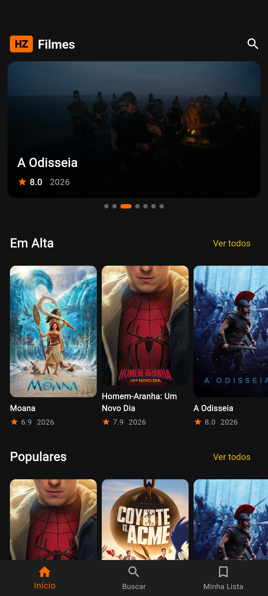
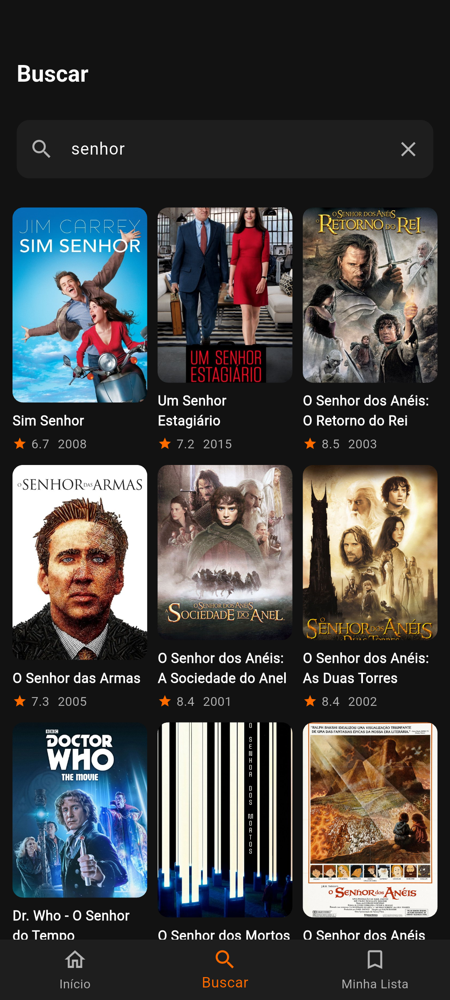
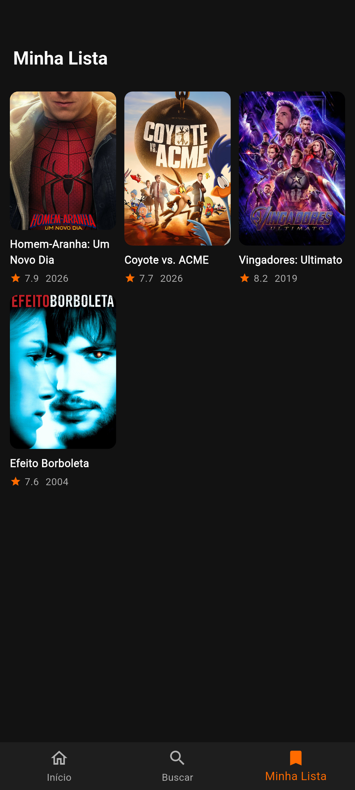
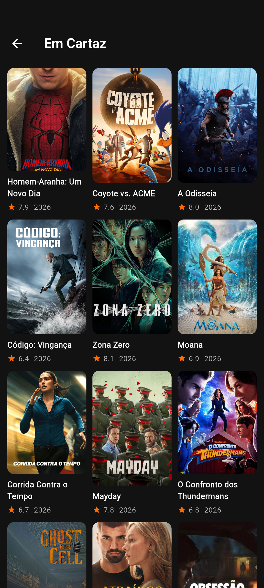
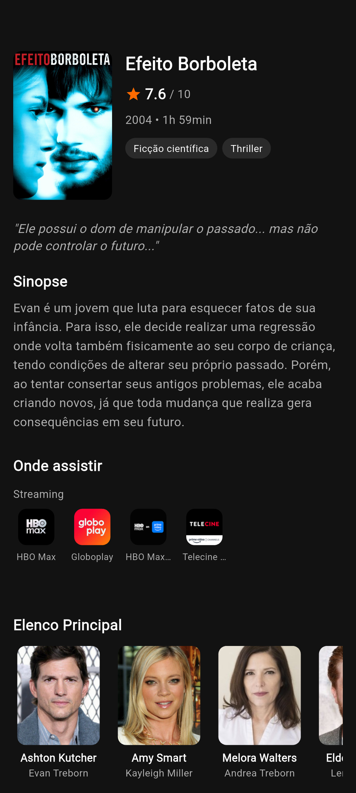
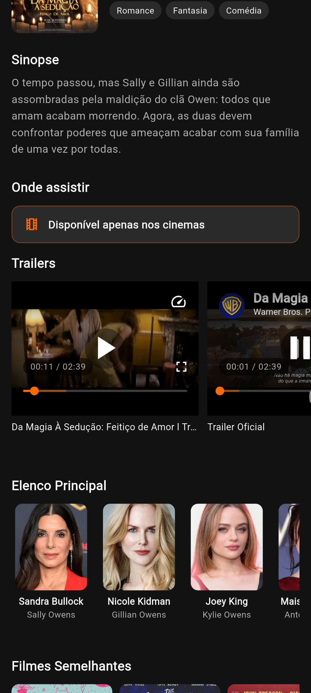

# 🎬 HZ Filmes

<p align="center">
  
</p>

<p align="center">
  <strong>App de catálogo de filmes moderno, rápido e com sistema de recomendações personalizado</strong><br/>
  Desenvolvido em Flutter com Clean Architecture, BLoC, Material Design 3, API própria, MySQL e integração com TMDB
</p>

<p align="center">
  
  
  
  
  
  
  
  
  
</p>

---

## 📱 Screenshots

<p align="center">
  <em>Home, detalhes do filme, busca, favoritos, recomendações e listas com paginação.</em>
</p>

<p align="center">
  
  
  
  
  
  
  
  
</p>

---

## ✨ Funcionalidades

* 🏠 **Home com seções dinâmicas**
  * Em Alta (trending)
  * Populares
  * Melhores Avaliados
  * Em Breve
  * Em Cartaz
  * **Recomendados para você**
* 🎠 **Banner em destaque** com carrossel e cache diário
* 🔎 **Busca de filmes** com paginação infinita
* 📄 **Detalhes completos do filme**
  * Poster, backdrop, nota, ano e duração
  * Gêneros e tagline
  * Sinopse
  * Elenco principal
  * Filmes semelhantes
* 📺 **Onde assistir** (Watch Providers — região BR)
  * Streaming, aluguel e compra
  * Mensagem **“Disponível apenas nos cinemas”** quando não há providers
* ▶️ **Trailers** com player do YouTube embutido
* ⭐ **Minha Lista (favoritos)** com persistência local
* 🤖 **Sistema de recomendações personalizado**
  * Considera filmes favoritados
  * Considera os últimos filmes acessados
  * Considera as últimas buscas realizadas
  * Busca filmes semelhantes aos conteúdos de interesse
  * Combina resultados de filmes semelhantes e pesquisas recentes
  * Remove resultados duplicados
* 📊 **Registro de atividade do usuário**
  * Histórico de buscas
  * Histórico de cliques em filmes
  * Armazenamento local para funcionamento das recomendações
  * Sincronização da atividade com a API própria
* 🗄️ **Backend próprio**
  * API REST desenvolvida em Node.js e Express
  * Integração com MySQL
  * Persistência de histórico de atividade
  * Persistência de favoritos no banco
  * Endpoint de health check
* 📋 **Ver todos** — listas completas com scroll infinito
* 🔄 **Pull-to-refresh** na home
* 🚀 **Splash screen** com branding
* 🌙 **Tema escuro** com Material Design 3
* 🖼️ **Imagens em cache** com shimmer de loading
* ⚠️ **Estados de UI** (loading, erro e empty states)

---

# 🛠️ Stack & Competências

## 💻 Linguagens e Frameworks

| Tecnologia            | Uso no projeto                                      |
| --------------------- | --------------------------------------------------- |
| **Dart 3**             | Linguagem principal do aplicativo                   |
| **Flutter**             | Desenvolvimento da interface multiplataforma       |
| **Material Design 3**   | Design system, temas e componentes                  |
| **JavaScript**          | Desenvolvimento da API/backend                      |
| **Node.js**             | Runtime do backend                                  |
| **Express.js**          | Criação da API REST                                 |
| **MySQL**               | Banco de dados relacional                           |

---

## 🏗️ Arquitetura

| Competência                        | Aplicação                                                                 |
| ---------------------------------- | ------------------------------------------------------------------------- |
| **Clean Architecture**             | Separação em `core`, `data`, `domain` e `presentation`                    |
| **State Management**               | BLoC (`flutter_bloc`) + Equatable                                         |
| **Repository Pattern**             | Contrato no domain + implementação no data                                |
| **DataSource Pattern**             | Separação entre fontes de dados locais e remotas                         |
| **Separação de responsabilidades** | UI desacoplada da lógica de negócio, persistência e APIs                  |
| **Service Layer**                  | `RecommendationService` centralizando a lógica de recomendações           |
| **API REST**                       | Backend próprio para persistência e registro de atividade                  |
| **Arquitetura cliente-servidor**   | Flutter consumindo API própria através de HTTP                             |

---

## 🌐 Dados e Rede

| Competência                     | Aplicação                                                        |
| ------------------------------- | ---------------------------------------------------------------- |
| **API REST**                    | Comunicação HTTP + JSON via Dio                                  |
| **TMDB API**                    | Filmes, busca, detalhes, elenco, trailers e watch providers      |
| **API própria**                 | Registro de atividade e persistência de dados do usuário         |
| **Dio**                         | Cliente HTTP utilizado para comunicação com APIs                  |
| **Cliente HTTP centralizado**   | `DioClient` com interceptors e configuração de requisições        |
| **Paginação**                   | Listas e busca com carregamento sob demanda                       |
| **Tratamento de erros de rede** | Timeout, falhas de API e feedback amigável na UI                  |
| **CORS**                        | Configuração de acesso entre cliente e backend                    |

---

## 🗄️ Backend e Banco de Dados

O projeto possui uma **API própria desenvolvida em Node.js + Express**, responsável por intermediar a comunicação com o banco de dados MySQL.

### Backend

| Tecnologia / Competência | Aplicação |
| ------------------------ | --------- |
| **Node.js**              | Runtime da API |
| **Express.js**           | Framework para criação das rotas REST |
| **mysql2**               | Comunicação entre Node.js e MySQL |
| **dotenv**               | Gerenciamento de variáveis de ambiente |
| **CORS**                 | Controle de requisições entre aplicações |
| **REST API**             | Endpoints para atividade e favoritos |
| **Connection Pool**      | Pool de conexões com o MySQL |
| **JSON**                 | Formato de comunicação entre cliente e servidor |
| **HTTP Status Codes**    | Respostas diferenciadas para sucesso e erros |

### Banco de Dados

**MySQL** é utilizado como banco de dados relacional do backend.

O banco armazena informações relacionadas à atividade do usuário, permitindo registrar e consultar dados utilizados pelo sistema.

Estrutura atualmente utilizada:

```text
MySQL
└── hz_filmes
    ├── users
    ├── search_history
    ├── click_history
    └── favorites
```

### Dados armazenados

| Tabela | Finalidade |
| ------ | ---------- |
| **users** | Estrutura preparada para identificação dos usuários |
| **search_history** | Armazena as pesquisas realizadas |
| **click_history** | Registra os filmes acessados |
| **favorites** | Armazena informações dos filmes favoritados |

> O sistema atualmente utiliza um usuário de demonstração (`user_id = 1`) nas rotas do backend. A estrutura permite evoluir posteriormente para autenticação e usuários reais.

---

## 🤖 Sistema de Recomendações

O HZ Filmes possui uma camada própria de recomendação através do `RecommendationService`.

A lógica utiliza diferentes sinais de interesse do usuário:

```text
                  ┌─────────────────────┐
                  │      Usuário        │
                  └──────────┬──────────┘
                             │
              ┌──────────────┼──────────────┐
              ▼              ▼              ▼
         Favoritos        Cliques         Buscas
              │              │              │
              └──────────────┼──────────────┘
                             ▼
                  RecommendationService
                             │
                 ┌───────────┴───────────┐
                 ▼                       ▼
          Filmes semelhantes       Resultados de busca
                 │                       │
                 └───────────┬───────────┘
                             ▼
                    Remoção de duplicados
                             │
                             ▼
                    Filmes recomendados
                             │
                             ▼
                         Home Page
```

### Critérios utilizados

1. **Favoritos**
   * Filmes salvos pelo usuário são utilizados como referência.

2. **Últimos cliques**
   * Filmes acessados recentemente são utilizados como referências de interesse.

3. **Últimas buscas**
   * Pesquisas recentes ajudam a identificar assuntos de interesse.

4. **Filmes semelhantes**
   * A API do TMDB é consultada para encontrar conteúdos semelhantes aos filmes utilizados como referência.

5. **Busca por interesses**
   * Termos pesquisados recentemente são reutilizados para encontrar novos filmes.

6. **Deduplicação**
   * Filmes repetidos são removidos antes da exibição.

7. **Limitação de resultados**
   * O sistema trabalha com uma quantidade controlada de recomendações para manter a home organizada.

---

## 📊 Rastreamento de Atividade

O aplicativo registra ações relevantes do usuário tanto localmente quanto no backend.

### Armazenamento local

O `ActivityLocalDataSource` utiliza **SharedPreferences** para armazenar:

```text
user_search_history
user_click_history
```

São mantidos até 30 registros recentes para cada tipo de atividade.

### API própria

O aplicativo também envia atividades para o backend:

```text
POST /activity/search
POST /activity/click
GET  /activity/history
```

Esses dados são persistidos no MySQL através das tabelas:

```text
search_history
click_history
```

A comunicação com o backend é feita através do Dio.

---

## ⭐ Favoritos

Os favoritos possuem persistência local através do `FavoritesBloc` e `SharedPreferences`.

O backend também possui uma API REST para gerenciamento de favoritos:

```text
GET    /favorites
POST   /favorites
DELETE /favorites/:movieId
```

Os dados enviados ao backend incluem informações como:

```text
movie_id
title
poster_path
vote_average
release_date
user_id
```

O backend utiliza `ON DUPLICATE KEY UPDATE` para evitar duplicidade de registros.

---

## 📱 Persistência e Mídia

| Competência              | Aplicação                                              |
| ------------------------ | ------------------------------------------------------ |
| **Persistência local**   | SharedPreferences para favoritos e atividade            |
| **Persistência remota**  | MySQL através da API própria                            |
| **Cache de imagens**     | `cached_network_image` + placeholders com shimmer       |
| **Trailers**             | `youtube_player_flutter` para reprodução inline         |
| **Links externos**       | `url_launcher` para abrir páginas de providers          |
| **Datas e formatação**   | `intl` com suporte a `pt_BR`                            |
| **JSON**                 | Serialização e desserialização de dados                 |

---

## 🎨 UX / UI

| Competência                 | Aplicação                                           |
| --------------------------- | --------------------------------------------------- |
| **Tema escuro**             | Paleta customizada com laranja de destaque          |
| **Material Design 3**       | Componentes, temas e identidade visual              |
| **Estados de UI**           | Loading, erro, empty e conteúdo                     |
| **Shimmer**                 | Skeleton loading em cards e home                    |
| **Listas horizontais**      | Seções de filmes e elenco                           |
| **Grid com paginação**      | Tela “Ver todos” e resultados de busca              |
| **Navegação por abas**      | Início, Buscar e Minha Lista                        |
| **Splash animada**          | Entrada com branding do app                         |
| **Pull-to-refresh**         | Atualização manual da página inicial                |
| **Responsividade**           | Interface adaptada para diferentes tamanhos de tela |

---

## 🧪 Qualidade e Boas Práticas

| Competência                        | Aplicação                                                          |
| ---------------------------------- | ------------------------------------------------------------------ |
| **Null Safety**                    | Dart null-safe                                                     |
| **Widgets reutilizáveis**          | `MovieCard`, `MovieSection`, `FeaturedBanner`, `TrailerCard`       |
| **BLoCs testáveis**                | Events/States separados + estrutura preparada para testes          |
| **Testes unitários**               | `flutter_test`, `mocktail` e `bloc_test`                            |
| **Ciclo de vida**                  | `dispose` de controllers e players                                 |
| **Separação de responsabilidades** | Datasources, repositories, services, blocs e pages independentes   |
| **Variáveis de ambiente**          | Configurações sensíveis do backend através de `.env`              |
| **Tratamento de exceções**          | Tratamento de falhas no cliente e servidor                         |
| **Reutilização de código**         | Services, repositories, datasources e widgets reutilizáveis        |

---

# 📁 Estrutura do Projeto

```text
hz_filmes/
│
├── lib/
│   ├── main.dart
│   │
│   ├── core/
│   │   ├── constants/
│   │   │   └── api_constants.dart
│   │   ├── network/
│   │   │   └── dio_client.dart
│   │   └── theme/
│   │       └── app_theme.dart
│   │
│   ├── data/
│   │   ├── datasources/
│   │   │   ├── local/
│   │   │   │   └── activity_local_datasource.dart
│   │   │   │
│   │   │   └── remote/
│   │   │       ├── movie_remote_datasource.dart
│   │   │       └── activity_remote_datasource.dart
│   │   │
│   │   ├── models/
│   │   │   ├── movie_model.dart
│   │   │   ├── video_model.dart
│   │   │   └── watch_provider_model.dart
│   │   │
│   │   └── repositories/
│   │       └── movie_repository_impl.dart
│   │
│   ├── domain/
│   │   └── repositories/
│   │       ├── movie_repository.dart
│   │       └── services/
│   │           └── recommendation_service.dart
│   │
│   └── presentation/
│       ├── blocs/
│       │   ├── home/
│       │   ├── search/
│       │   ├── favorites/
│       │   ├── movie_detail/
│       │   └── movie_list/
│       │
│       ├── pages/
│       │   ├── splash_page.dart
│       │   ├── main_page.dart
│       │   ├── home_page.dart
│       │   ├── search_page.dart
│       │   ├── favorites_page.dart
│       │   ├── movie_detail_page.dart
│       │   └── movie_list_page.dart
│       │
│       └── widgets/
│           ├── movie_card.dart
│           ├── movie_section.dart
│           ├── featured_banner.dart
│           ├── trailer_card.dart
│           └── home_loading.dart
│
├── hz-filmes-api/
│   ├── src/
│   │   ├── db.js
│   │   ├── server.js
│   │   └── routes/
│   │       ├── activity.js
│   │       └── favorites.js
│   │
│   ├── package.json
│   └── package-lock.json
│
├── assets/
│   ├── icon/
│   ├── image/
│   └── screenshots/
│
├── test/
├── pubspec.yaml
└── README.md
```

---

# 🔌 Arquitetura de Comunicação

O projeto atualmente possui duas fontes principais de dados:

### Filmes

```text
Flutter
   │
   ▼
Dio
   │
   ▼
TMDB API
   │
   ▼
Filmes / detalhes / trailers / providers
```

### Dados do usuário

```text
Flutter
   │
   ▼
ActivityRemoteDataSource
   │
   ▼
Dio
   │
   ▼
Node.js + Express
   │
   ▼
MySQL
```

### Arquitetura completa

```text
                         ┌─────────────────┐
                         │    Flutter      │
                         │  Presentation   │
                         └────────┬────────┘
                                  │
                         ┌────────▼────────┐
                         │      BLoC       │
                         └────────┬────────┘
                                  │
                  ┌───────────────┴────────────────┐
                  ▼                                ▼
        ┌──────────────────┐             ┌──────────────────┐
        │ MovieRepository  │             │ Recommendation   │
        │                  │             │ Service          │
        └────────┬─────────┘             └────────┬─────────┘
                 │                                │
                 ▼                                ▼
        ┌──────────────────┐             ┌──────────────────┐
        │ RemoteDataSource │             │ LocalDataSource  │
        └────────┬─────────┘             └────────┬─────────┘
                 │                                │
                 ▼                                ▼
              Dio                         SharedPreferences
                 │
                 ▼
             TMDB API


        Atividade do usuário
                 │
                 ▼
        ActivityRemoteDataSource
                 │
                 ▼
                Dio
                 │
                 ▼
          Node.js + Express
                 │
                 ▼
               MySQL
```

---

# 🚀 Como Rodar

## 📋 Pré-requisitos

* Flutter SDK **3.13+**
* Dart compatível com a versão instalada do Flutter
* Node.js
* MySQL
* Android Studio e/ou Xcode
* Emulador ou dispositivo físico
* Git
* Conta e API Key no [The Movie Database (TMDB)](https://www.themoviedb.org/settings/api)

---

## 🔑 Configurar a API Key

1. Crie uma conta no TMDB.
2. Gere uma API Key em **Settings → API**.
3. Configure a chave em:

```text
lib/core/constants/api_constants.dart
```

```dart
static const String apiKey = 'SUA_API_KEY_AQUI';
```

> **Dica para portfólio:** em produção, prefira passar a key via `--dart-define` ou outra estratégia segura de gerenciamento de secrets.

---

# 🗄️ Configurar o MySQL

Crie um banco de dados chamado:

```text
hz_filmes
```

Depois configure as variáveis de ambiente do backend em:

```text
hz-filmes-api/.env
```

Exemplo:

```env
PORT=3000

DB_HOST=localhost
DB_USER=seu_usuario
DB_PASSWORD=sua_senha
DB_NAME=hz_filmes
```

> Nunca envie senhas reais ou outras credenciais para o GitHub. O arquivo `.env` deve permanecer no `.gitignore`.

As tabelas utilizadas pelo backend devem existir no banco antes da execução da API.

---

# 🟢 Executar o Backend

Entre na pasta:

```bash
cd hz-filmes-api
```

Instale as dependências:

```bash
npm install
```

Execute a API:

```bash
npm start
```

O backend será iniciado na porta configurada no `.env`.

Endpoint de verificação:

```text
GET /health
```

Resposta esperada:

```json
{
  "ok": true
}
```

---

# 📱 Executar o Flutter

Na raiz do projeto:

```bash
flutter pub get
```

Depois:

```bash
flutter run
```

---

## 🌐 Configuração do endereço do Backend

O aplicativo possui uma URL específica para a API própria em:

```text
lib/core/constants/api_constants.dart
```

Exemplo:

```dart
static const String backendBaseUrl = 'http://SEU_IP:3000';
```

Quando estiver executando o aplicativo em um dispositivo físico, o IP deve apontar para o computador que está executando o backend na mesma rede.

---

# 📥 Clonar o projeto

```bash
git clone https://github.com/SEU_USUARIO/hz_filmes.git
cd hz_filmes
flutter pub get
```

Depois configure o backend:

```bash
cd hz-filmes-api
npm install
npm start
```

---

# ▶️ Executar

Com o backend em execução, volte para a raiz do projeto:

```bash
cd ..
flutter run
```

---

# 📦 Build Release — Android

Para gerar uma versão de produção:

```bash
flutter build apk --release
```

O APK será gerado em:

```text
build/app/outputs/flutter-apk/app-release.apk
```

Também é possível executar diretamente em modo release:

```bash
flutter run --release
```

---

# 🔐 Permissões

## Android

Arquivo:

```text
android/app/src/main/AndroidManifest.xml
```

Permissão utilizada:

```xml
<uses-permission android:name="android.permission.INTERNET"/>
```

### Finalidade

| Permissão  | Finalidade                                      |
| ---------- | ----------------------------------------------- |
| `INTERNET` | Comunicação com TMDB, backend, imagens e trailers |

---

## 🍎 iOS

Arquivo:

```text
ios/Runner/Info.plist
```

O aplicativo utiliza conexão de rede para comunicação com as APIs e carregamento de conteúdo externo.

---

# 🔌 APIs Utilizadas

| API | Função | Autenticação |
| --- | ------ | ------------ |
| **TMDB — Movies** | Trending, populares, top rated, upcoming e now playing | API Key |
| **TMDB — Search** | Busca de filmes | API Key |
| **TMDB — Movie Details** | Detalhes, créditos e filmes semelhantes | API Key |
| **TMDB — Videos** | Trailers | API Key |
| **TMDB — Watch Providers** | Onde assistir por região (BR) | API Key |
| **TMDB Images** | Posters, backdrops e imagens | — |
| **API HZ Filmes** | Atividade do usuário e favoritos | — |
| **YouTube** | Reprodução dos trailers | via `youtube_player_flutter` |

---

# 📦 Principais Dependências

### Flutter

```yaml
dependencies:
  flutter:
    sdk: flutter

  cupertino_icons: ^1.0.8
  dio: ^5.11.1
  flutter_bloc: ^9.1.1
  equatable: ^2.1.0
  cached_network_image: ^4.0.0
  shimmer: ^4.0.0
  google_fonts: ^8.2.1
  intl: ^0.20.3
  shared_preferences: ^2.5.5
  hive: ^2.2.3
  hive_flutter: ^1.1.0
  path_provider: ^2.1.6
  url_launcher: ^6.3.2
  youtube_player_flutter: ^10.0.1
```

### Testes e desenvolvimento

```yaml
dev_dependencies:
  flutter_test:
    sdk: flutter
  flutter_lints: ^6.0.0
  build_runner: ^2.4.13
  mocktail: ^1.0.5
  bloc_test: ^10.0.0
  flutter_launcher_icons: ^0.14.4
```

### Backend

```json
{
  "express": "API REST",
  "mysql2": "Conexão com MySQL",
  "cors": "Cross-Origin Resource Sharing",
  "dotenv": "Variáveis de ambiente",
  "bcryptjs": "Preparação para gerenciamento seguro de senhas",
  "jsonwebtoken": "Preparação para autenticação baseada em JWT"
}
```

> As versões efetivamente utilizadas podem ser consultadas nos arquivos `pubspec.lock` e `package-lock.json`.

---

# 🧠 Fluxo principal

```text
UI (Pages / Widgets)
        │
        ▼
     BLoCs
        │
        ▼
  Repository / Services
        │
        ├──────────────────────┐
        ▼                      ▼
   TMDB API              API HZ Filmes
                               │
                               ▼
                             MySQL
```

---

# 🤖 Fluxo de Recomendações

```text
Favoritos ───────────────┐
                         │
Últimos cliques ─────────┼──► RecommendationService
                         │             │
Últimas buscas ──────────┘             │
                                       ▼
                              Filmes semelhantes
                                       +
                              Resultados de busca
                                       │
                                       ▼
                                Deduplicação
                                       │
                                       ▼
                              Até 20 recomendações
                                       │
                                       ▼
                                  Home Page
```

---

# 📌 Observações

* O app está configurado para **português (pt-BR)** e providers da região **Brasil**.
* Filmes sem opções de streaming/aluguel/compra exibem o card **“Disponível apenas nos cinemas”**.
* O sistema de recomendações combina dados de favoritos, cliques e buscas recentes.
* A atividade do usuário é armazenada localmente e também pode ser enviada para a API própria.
* O backend utiliza **Node.js, Express e MySQL**.
* O banco de dados utilizado pelo backend é **MySQL**.
* O backend possui endpoints específicos para atividade e favoritos.
* Atualmente as rotas do backend utilizam um usuário de demonstração (`user_id = 1`).
* A autenticação de usuários é uma evolução planejada para a arquitetura do backend.
* O projeto utiliza uma arquitetura separando apresentação, domínio, dados e infraestrutura.
* Este projeto foi desenvolvido para **portfólio**, com foco em demonstrar desenvolvimento Flutter, consumo de APIs, arquitetura de software, persistência local, backend, banco de dados relacional e regras de negócio.

---

# 🎯 Competências Demonstradas

Este projeto reúne conhecimentos de desenvolvimento **mobile, backend, APIs e banco de dados**:

```text
Flutter
Dart
Clean Architecture
BLoC
Repository Pattern
DataSource Pattern
Service Layer
Material Design 3
Dio
API REST
JSON
TMDB API
Node.js
Express.js
MySQL
mysql2
SQL
Connection Pool
CORS
dotenv
SharedPreferences
Persistência local
Persistência remota
Paginação
Cache de imagens
YouTube Player
Watch Providers
Sistema de recomendações
Histórico de usuário
Modelagem de dados
Tratamento de erros
Null Safety
Testes
Git
GitHub
```

---

# 📄 Licença

Este projeto está sob a licença **MIT**.

---

<p align="center">
  Feito com ☕ e Flutter
</p>